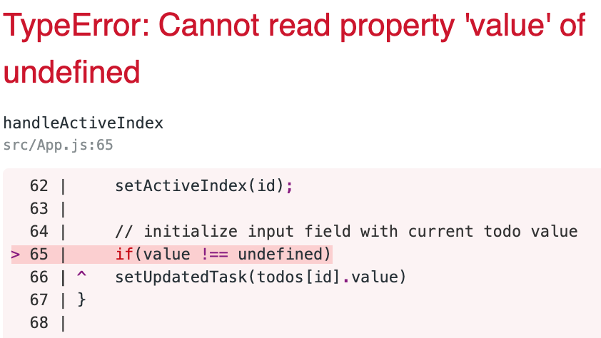

## Important Configuration details
1) ### Set up React app `yarn create react-app app`

2) ### Add Dependencies  
    `yarn add moment react-dom react-loader-spinner react-rainbow-components react-router-dom react-scripts react-spinners-kit reactn reactn-devtools semantic-ui-react styled-components redux reinspect redux-devtools-extension react-select`  

    - For `react-loaded-spinner`, you must also add `styled-components`
    - For `semantic-ui-react`, you must also 
        add to `index.html`  
        ~~~ html 
        <link rel="stylesheet" href="//cdn.jsdelivr.net/npm semantic-ui@2.4.2/dist/semantic.min.css" />
        ~~~
3) ### React DevTools extension `hooks` configuration        
    - To utilize the `redux devtools extension` with 'hooks, add the following to `src/index.js`
        import `StateInspector`
        ~~~ js
        import { StateInspector } from 'reinspect';
        ~~~
        Define a `Wrapper` component and wrap the `App` component 
        ~~~ js
        const Wrapper = () => {
            return (
                <StateInspector>
                    <App/>
                </StateInspector>
            )
        }

        ReactDOM.render(<Wrapper />, document.getElementById('root'));
        ~~~        
    - The following `hooks` are setup to manage todos
        ~~~ js
        const [task, setTask] = useState('', "Task");
        const [todos, setTodos] = useState([], "Todos");
        const [priority, setPriority] = useState('', "Priority");
        const [updatedTask, setUpdatedTask] = useState('', "Updated Task");
        const [activeIndex, setActiveIndex] = useState('', 'Active Index');
        ~~~
4) ### Configuration of the `Select` component used by`react-select`   
    - The `react-select` component uses the following `hooks` to manage the dropdown values and reset to `Select...` after selection made
        ~~~ js
        const initial = {selectedKey: null};
        const [dropDownVal, setDropDownVal] = useState(initial, "DropDownValues")
        ~~~    
    - The `react-select` component uses s special `Select` commponent with the following `props`
        ~~~ js 
        <Select
            width = '50px'
            value = {options.filter(({value}) => value === dropDownVal.selectedKey)}
            onChange={({ value }) => updateDropDown(value)}
            options = {options}
        />
        ~~~   
    - The following handler manages the dropdown down value of the `react-select` component
        ~~~ js   
        const updateDropDown = value => {
        setDropDownVal({...dropDownVal, selectedKey: value});  
        }
        ~~~
5) ### Task management handlers for new todo item
    - A simple `change handler` is used for text input
        ~~~ js
        const handleChange = e => {
            const {value} =  e.target;    
            setTask(value); 
        }
        ~~~        
    - The `submit handler` prepares user input for the todo list. User input logic is verified before adding todo and the form is reset for the next todo.
        ~~~ js
        const handleSubmit = (e) => {
            e.preventDefault();
            
            const newTask = {
                value: task,
                priority: dropDownVal.selectedKey,
                complete: false,
            }

            if(task !== '' && priority !== null) {
                setTodos([...todos, newTask]);
                setTask('');
                setDropDownVal(initial);
            }        
        } 
        ~~~
6) ### Updating todo items
    - For updating todos, the current todo text is populated into the input field for modification. The `activeIndex` hook helps manage updating for both the input field and the select dropdown. This prevents the `updatedTask` hook from updating all input fields. 
    
        The current task value is populates the currently selected todo input field:
        ~~~ js
        const handleUpdatedDescriptionId = (e) => {
            const {value, id} = e.target;

            setActiveIndex(id);

            if(value) setUpdatedTask(todos[id].value)
        }
        ~~~
        Note: Not using `value` as a truthy/falsey results in an error message
         
 
        
        

        The following handler manages the updated text
        ~~~ js
        const handleUpdatedTask = (e) => {
            const {value, id} = e.target;

            if(activeIndex === id) {
                setUpdatedTask(value);
            }
        }
        ~~~

        Updated priority is managed with the `handlePriority` handler. A standard `select` is used to differeniate from the `react-select` component.
        ~~~ js
        const handlePriority = async (e) => {    
            const {value, id} =  e.target;
            setActiveIndex(id);    
            return await setPriority(value);        
        }        
        ~~~

        Each updated task is managed with the `updatedTask` handler. The logic ensures that blank text does not replace the todo description and / or a new priority has been chosen.
        ~~~ js
        const updateTask = (e) =>{
            let {id} = e.target

            if(activeIndex === id ){
                if(priority !== ''){
                    todos[id].priority = priority;
                }
                if(updatedTask) {
                    todos[id].value = updatedTask;
                }
                setTodos([...todos]);
            } 
            
            resetPriorityTaskIndex();
        }
        ~~~
7) ### Resetting state
    - The `resetPriorityTasksIndex` is used to reset the `priority` & `activeIndex` hooks after updating a task or clearing all todos.
        ~~~ js
        const resetPriorityTaskIndex = () => {
            setPriority('');
            setActiveIndex('');
        }
        ~~~
        The `clearTodos` handler also resets the `todos` array.
        ~~~ js
        const resetPriorityTaskIndex = () => {
            setPriority('');
            setActiveIndex('');
        }

    ~~~
8) ### Toggling Completion status
    - The current id is used is passed as a prop for the simpler functionality of toggling & deleting todos.
        ~~~ html
        
 toggleComplete(id)}  > Done: {item.complete.toString()}    

        <button id = {index} onClick = {(id) => toggleComplete(id)} > Toggle Complete</button>
        ~~~
        The `event id` is used to target to appropriate todo item and the `spread operator` used to update the array.
        ~~~ js
        const toggleComplete = (e) => {
            const {id} = e.target
            
            todos[id].complete = !todos[id].complete;
            setTodos([...todos]);
        }
        ~~~
        ~~~ js
        const handleDelete = (id) => {
            todos.splice(id, 1);
            setTodos([...todos]);
        }
        ~~~
9) ### Deleting todos is     